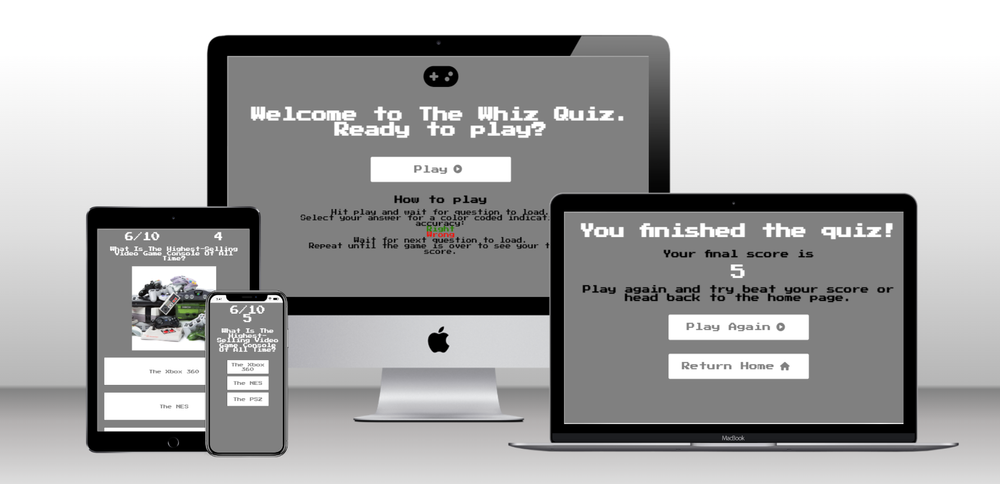
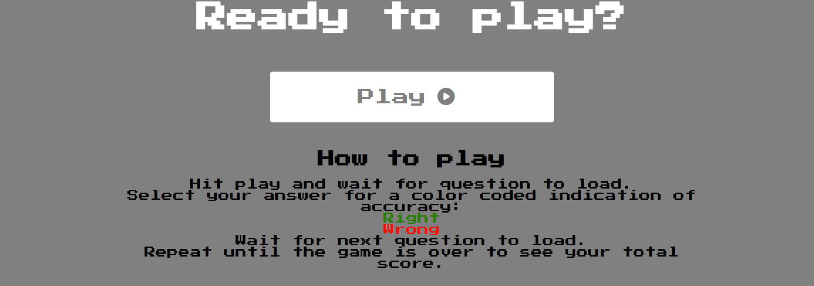
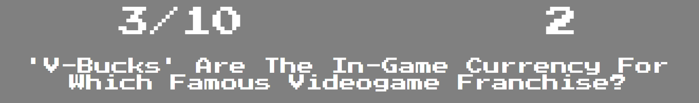
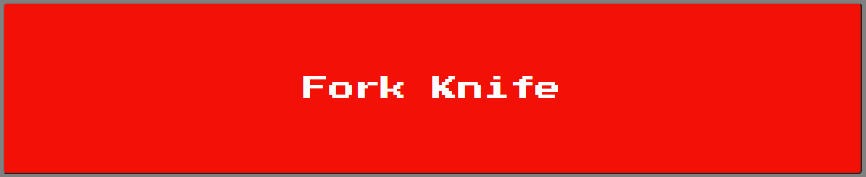
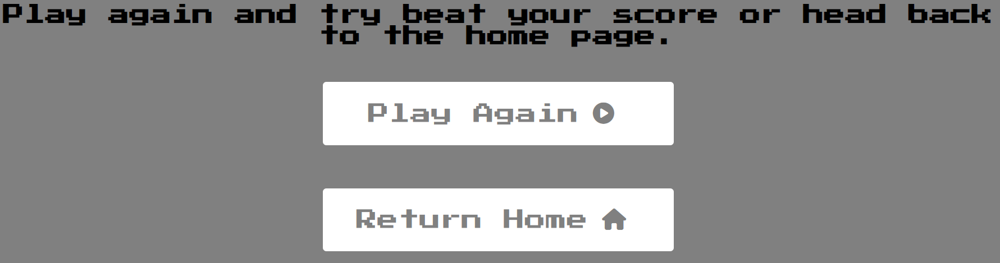

# Whiz Quiz

Whiz quiz is a fully responsive demonstration of javascript application in a web based quiz, designed to test the player's knowledge of video game pop culture. It is aimed at members of the gaming demographic that hold knowledge of both modern and older gaming refrences.

View the live website [here](https://davidjf97.github.io/whizquiz/) 

## Features

### Welcome page

* Logo and Welcome
    * The site opens up to the welcome page, presenting the viewer with the quiz's logo and a warm welcome.
    * This gives the user a natural feeling starting point to set off from. The logo matched the favicon so already there is synchronicity and recognition in the design.

* Play button and How-to-Play
    * Below the welcome is the invitation to play, followed by a "Play" button which starts the game. 
    Below which are instructions on how to play.
    * The invitation to play makes sense in the flow of gameplay, the player must hit the play button when they are ready to play,
    it is simple and effective. When they are ready th ebutton takes them to the game page.
    * The instructions below let the player know how to play the game and what to expect as they play through. 

### Game page

* HUD and Question display
    * The games page has first and foremost a Heads Up Display the top of the screen. Followed by the current quiz question.
    * The Hud serves to display relevant information to the player. The number on the left indicates which question out of 10 they are currently playing and the number on the right is their current score. This is omportant information for the player to have so they are aware of their progress and even to aim for higher scores on replay. 

* Option Buttons
    * The player is presented with the three options to answer the question with. Only one is correct. Their accuracy is indicated by the chosen option turning either green or red as stated in the "How To Play" section of the home page.
    * The color change indication works well as a visual cue to the player. Red being widely accepted as indicating "bad", "stop" or "wrong", while green is normally accepted as meaning "Good", "Go", "Okay". Due to this all player should be able to instantly identify with and understand whichever color they are presented with as they play through.

### End page

* Final Score
    * Upon finishing the quiz the player is told they've reached the end and are presented with their final score.
    * The user gets to see how they did, indicated numerically as their final score

* Replay or Go Home buttons
    * Below their final score the player is prompted to either replay or to leave and go to the home page.
    * This end page gives the player the option of a natural end the quiz or to play again for a better score. 

## Testing

* The site was tested repeatedly as it was developed. I used the google chrome developer tools console heavily through out to log values as I worked through the site and view any error codes that came up as the site was being developed.

* I have tested the webpage on a number of different mobile devices available on the google chrome developer tools to make sure they where responsive.
    * iPhone 13 Pro
    * iPhone 12 Pro
    * Pixel 5
    * iPhone 8 Plus
    * MacBook Pro 13"
    * Samsung Galaxy S20 Ultra
    * iPad Air
    * iPad Mini
    * Surface Pro 7
    * Samsung Galaxy A51/71

## Validator Testing
* HTML
    * No errors were returned when passing through the official [W3C validator](https://validator.w3.org/nu/)
* CSS
    * No errors were found when passing through the official [(Jigsaw) validator](https://jigsaw.w3.org/css-validator/)
* JavaScript
    * No errors were found when passing through the official [Jshint validator](https://jshint.com/)
    * The following metrics were returned:
        * There are 5 functions in this file.
        * Function with the largest signature take 0 arguments, while the median is 0.
        * Largest function has 12 statements in it, while the median is 6.
        * The most complex function has a cyclomatic complexity value of 3 while the median is 1.

## Deployment
* The site was deployed to GitHub pages. The steps to deploy are as follows:
    * In the GitHub repository, navigate to the Settings tab
    * From the source section drop-down menu, select the Master Branch
    * Once the master branch has been selected, the page will be automatically refreshed with a detailed ribbon display to indicate the successful deployment.
The live link can be found here - [https://davidjf97.github.io/whizquiz/](https://davidjf97.github.io/whizquiz/)

## Credits

* Questions for the quiz sourced from [mantelligence](https://www.mantelligence.com/video-game-trivia/)
* Learned to used the setTimeout for timing execution of some of my functions on [w3schools](https://www.w3schools.com/js/js_timing.asp)
* Learned about using local storage for my final score on [developer.mozilla](https://developer.mozilla.org/en-US/docs/Web/API/Window/localStorage)